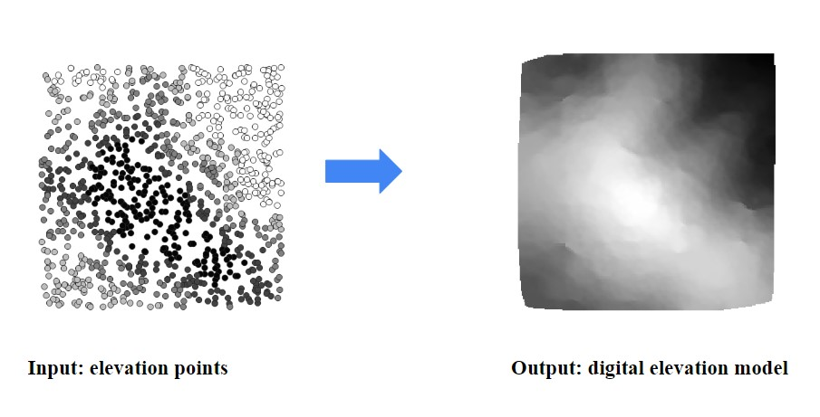

# Spatial_interpolator
The spatial_interpolator is a interpolation tool that takes surveying elevation points as input, and generating digitial elevalation models, using interpolation methods. 

It is developed by me and Chrysanthi Papadimitriou, as one digital terrain modelling [course project](https://3d.bk.tudelft.nl/courses/backup/geo1015/2021/hw/01/), as partial fulfillment for the Geomatics master's program at TU Delft.

There are four implemented interpolation methods for the users to choose:
- nearest neighbour
- IDW with its variants
- linear interpolation with TIN
- Laplace interpolation

## Table of Contents

- [Input file requirements](#Input_file_requirements)
- [How to run](#How_to_run)
- [Sample results](#Sample_results)

## Input file requirements

The input file for the spatial interpolator tool should be a text file contain:
- a header line: x y z
- each line with x,y,z coordinates of the elevation points

The following is a minimium example:
x y z
6 244 72.97872
212 133 64.5

## How to run

Before running the project, the following packages should be installed using pip install:
- math
- numpy
- scipy
- startinpy 
- sys
- math
- csv
- random
- json 
- time

The users can specify the input path, output path, and interpolation parameters in params.json file.

After installing the required packages and specifying the parameters, simply running the main.py will give you the digital elevation model you want!

## Sample results

